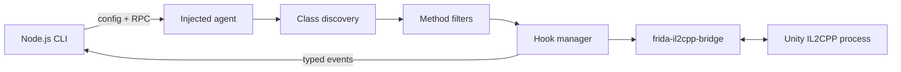

# Frida IL2CPP Toolkit

[](LICENSE)
[](https://nodejs.org/)
[](https://frida.re/)

Selective, stability-first runtime instrumentation for large Unity IL2CPP applications.

Frida IL2CPP Toolkit finds one managed class, selects only the methods you care
about, and installs hooks at a controlled rate. It is designed for high-signal
sessions where tracing an entire application would produce too much noise or
destabilize the target.

> Use this toolkit only on software you own or are authorized to analyze.

## What it looks like

```text
Selected Assembly-CSharp -> Example.Network.ApiClient
Discovered 18 methods; selected 2
Installing 2 hooks...
  + System.Void Send(System.String payload) @ 0x7f33a28140
  + System.String Receive() @ 0x7f33a28310
Active hooks: 2; failed: 0; candidates: 2
-> Example.Network.ApiClient.Send(payload="hello") this=0x7f3499c120
<- Example.Network.ApiClient.Receive: "accepted"
```

For pipelines, the same events can be emitted as JSON Lines:

```json
{"timestamp":"2026-09-11T12:00:00.000Z","type":"hook.call","callId":"Assembly-CSharp:Example.Network.ApiClient:Send(System.String)#1","method":{"id":"Assembly-CSharp:Example.Network.ApiClient:Send(System.String)","className":"Example.Network.ApiClient","name":"Send","signature":"System.Void Send(System.String payload)","isStatic":false,"parameters":[{"name":"payload","typeName":"System.String"}],"returnTypeName":"System.Void","address":"0x7f33a28140"},"arguments":[{"name":"payload","value":"\"hello\""}],"thisPointer":"0x7f3499c120"}
```

## Why use it

- Target classes by assembly, namespace and exact or partial class name.
- Compose method substring, regular-expression and exclusion filters.
- Preview strings, primitives and pointers without deep object traversal.
- Rate-limit installation and cap the number of active hooks.
- Detach every hook cleanly when the session ends.
- Consume human-readable output or structured JSONL events.

## Architecture



The host owns device selection, process attachment and output. The injected agent
owns IL2CPP discovery, value inspection and hook lifecycle. There is one supported
implementation: the TypeScript source under `src/`.

## Requirements

- Node.js 22.13 or newer
- A target application built with Unity IL2CPP
- A Frida setup compatible with the target device

## Quick start

```bash
git clone https://github.com/eysap/frida-il2cpp-toolkit.git
cd frida-il2cpp-toolkit
npm ci
npm run build
```

Create `target.json`:

```json
{
  "target": {
    "assembly": "Assembly-CSharp",
    "namespace": "Example.Network",
    "className": "ApiClient"
  },
  "filters": {
    "methodRegex": "^(Send|Receive)$"
  },
  "performance": {
    "hookDelayMs": 25,
    "maxHooks": 100
  },
  "logging": {
    "args": true,
    "return": true,
    "showThis": true
  }
}
```

Attach to a running process:

```bash
npm run cli -- --name "Game.x64" --config target.json
```

Or spawn an application on a USB device:

```bash
npm run cli -- \
  --spawn com.example.game \
  --device usb \
  --config target.json
```

List processes visible to Frida:

```bash
npm run cli -- --list --device usb
```

## CLI

```text
Targets:
  -p, --pid PID           attach to a process ID
  -n, --name NAME         attach by process name
  -f, --spawn PROGRAM     spawn a package or executable

Options:
  -c, --config PATH       JSON configuration file
  -D, --device DEVICE     local, usb, remote, or a Frida device ID
  -H, --host ADDRESS      connect to a remote frida-server
      --agent PATH        use a custom compiled agent
      --format FORMAT     pretty or jsonl
  -o, --output PATH       write events to a file
      --list              list processes
  -h, --help              show help
```

## Configuration reference

| Key | Type | Default | Purpose |
| --- | --- | --- | --- |
| `target.assembly` | string or null | `null` | Assembly, with optional `.dll` suffix |
| `target.namespace` | string or null | `null` | Exact managed namespace |
| `target.className` | string | required | Exact or fully-qualified class name |
| `target.fullName` | string or null | `null` | Alternative fully-qualified selector |
| `target.allowPartial` | boolean | `false` | Match class names by substring |
| `target.pickIndex` | integer | `0` | Choose among several matches |
| `filters.methodNameContains` | string or null | `null` | Required method-name substring |
| `filters.methodRegex` | string or null | `null` | Regular expression for method names |
| `filters.exclude` | string[] | `[]` | Method names or signatures to skip |
| `performance.enabled` | boolean | `true` | Enable hook installation |
| `performance.hookDelayMs` | number | `25` | Delay between installations |
| `performance.maxHooks` | positive integer | `300` | Hard cap on installed hooks |
| `logging.args` | boolean | `true` | Preview arguments |
| `logging.return` | boolean | `false` | Preview return values |
| `logging.showThis` | boolean | `true` | Include the instance pointer |
| `logging.maxArgs` | non-negative integer | `8` | Maximum arguments per call |

Selectors are combined: a method must satisfy every configured positive filter
and must not match an exclusion.

## Structured output

Use `--format jsonl` when another tool will consume the session. Events cover
class selection, discovery, hook installation, calls, returns, detachments and
warnings. Agent diagnostics stay on stderr so stdout remains valid JSONL.

```bash
npm run cli -- --name Game.x64 --config target.json \
  --format jsonl --output session.jsonl
```

## Development

```bash
npm ci
npm run check
```

`npm run check` runs ESLint, both TypeScript configurations, the Node test suite
and the production agent/host build. Pull requests run the same command in CI.

```text
src/
├── agent/    # injected runtime, inspection and hook lifecycle
├── host/     # CLI, Frida session and output
├── shared/   # configuration, selectors, descriptors and events
└── tools/    # toolkit orchestration
test/         # unit and CLI integration tests
```

## Limitations

- Value previews are intentionally shallow; arbitrary object graphs are not walked.
- A valid Frida/target pairing is required for a live instrumentation test.
- Methods without a usable virtual address are skipped.
- Platform-specific calling conventions can require target-specific testing.

## License

Released under the [MIT License](LICENSE).
